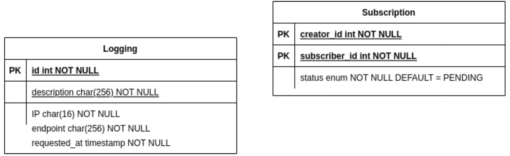

# Web Service SOAP

## Daftar Isi

- [Deskripsi](#deskripsi)
- [Skema Basis Data](#skema-basis-data)
- [Cara menjalankan server](#cara-menjalankan-server)
- [Endpoint](#endpoint)
- [Pembagian tugas](#pembagian-tugas)
- [Author](#author)

## Deskripsi

Webservice SOAP menangani pengajuan request subscription, serta menerima approval/rejection dari admin Binotify Premium. Service dibuat menggunakan JAX-WS (Java Servlet).

## Requirement

1. Java SDK 1.8

## Cara Menjalankan Server

1. Buat setup database dan sesuaikan file `.env` pada folder `webservice`
2. Import mysql database pada folder `sql`
3. Change directory ke webservice
4. Jalankan `mvn clean compile assembly:single`
5. Jalankan `java -jar ./target/webservice-1.0-SNAPSHOT-jar-with-dependencies.jar`
6. Jalankan endpoint generateKey untuk mendapatkan apiKey
7. Masukkan apiKey pada service Anda

## Skema Basis Data

Skema Database dari sistem ini adalah sebagai berikut.

## Endpoint

| Endpoints                              |
| -------------------------------------- |
| "http://%s:%s/webservice/subscription" |
| "http://%s:%s/webservice/generatekey"  |

## Pembagian Tugas

- Security: 13520049
- Menerima Permintaan Subscription dari Binotify App: 13520096
- Menerima Penerimaan/Penolakan Permintaan Subscription: 13520049
- Endpoint Check Status Permintaan: 13520129

## Author

- 13520049 - Aditya Prawira Nugroho
- 13520096 - Monica Adelia
- 13520129 - Nathanael Santoso
